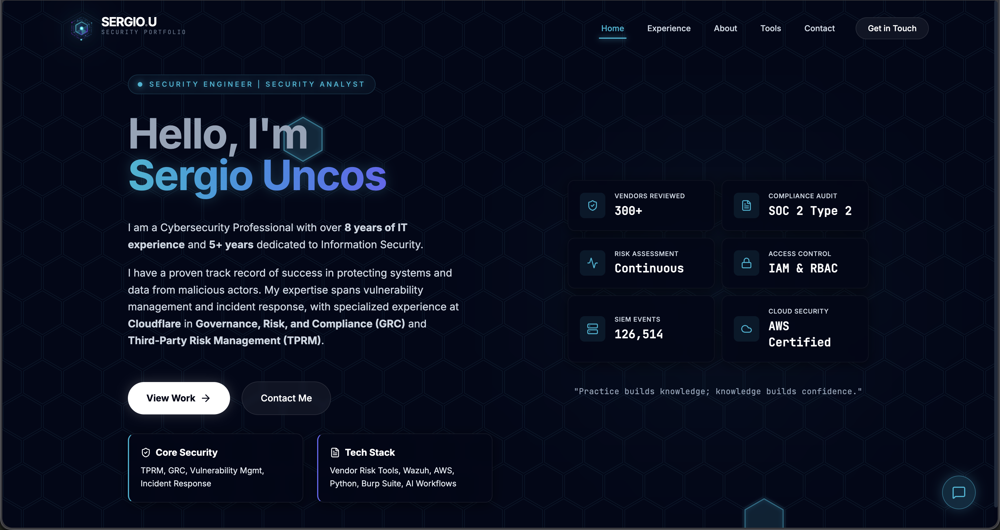

# Sergio Uncos | Security Portfolio

Personal portfolio for Sergio Uncos, focused on cybersecurity, risk management, security engineering, and technical profile presentation.

## Preview



## Overview

This project is a responsive portfolio built with React, TypeScript, and Vite. It includes:

- A custom landing page with security-themed visuals
- Work experience and professional background
- Skills organized by domain, infrastructure, tools, and AI/automation
- Certifications and recommended reading
- A contact section and interactive assistant widget

## Tech Stack

- React 19
- TypeScript
- Vite
- Framer Motion
- Tailwind-based utility styling
- Lucide React
- Recharts

## NPM Scripts

### Install dependencies

```bash
npm install
```

### Run in development

```bash
npm run dev
```

Vite will start a local dev server, usually at:

```bash
http://localhost:5173
```

If that port is already in use, Vite will automatically choose another one.

### Build for production

```bash
npm run build
```

This generates the production-ready output inside:

```bash
dist/
```

### Preview the production build

```bash
npm run preview
```

## Portfolio Assistant

The assistant runs entirely in the browser using the portfolio's local data. It does not require an API key or send visitor questions to a third-party service.

## Analytics

Page views are sent to the existing Google Analytics 4 property `G-WDGZL3L2WF`. Advertising personalization and Google Signals are disabled in the client configuration.

## Project Structure

```bash
components/
components/views/
docs/
constants.ts
App.tsx
index.tsx
vite.config.ts
```

## Repository

Connected remote:

- [sergiouncos.github.io](https://github.com/sergiouncos/sergiouncos.github.io)

Production deployment:

- [sergiouncos.github.io](https://sergiouncos.github.io/)

## Notes

- The current portfolio design is optimized for desktop and mobile layouts
- Some sections include motion and animated security visuals
- The project currently builds successfully with `npm run build`
- The previous production site is preserved in `backup/pre-revamp-2026-08-05` and the matching tag
- The former staging deployment was retired after the production rollout was verified
